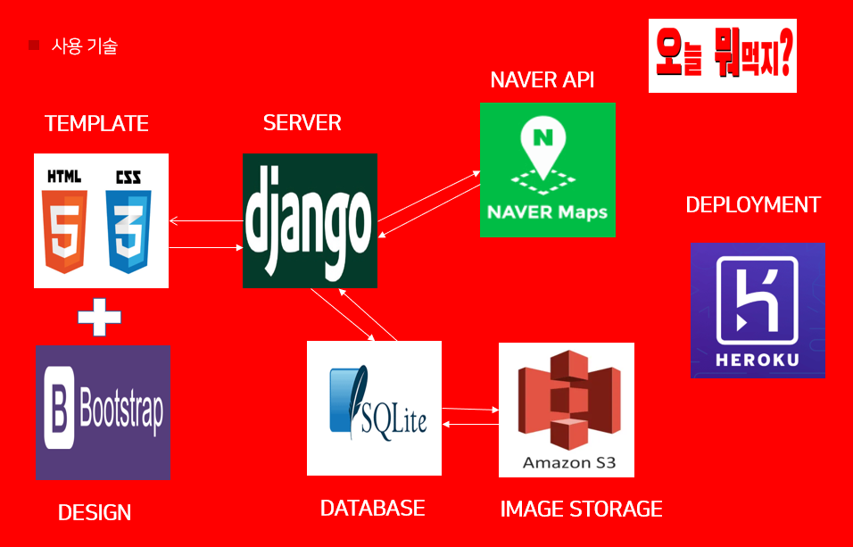

<h1> 오늘 뭐먹지?! </h1>

&nbsp;&nbsp;&nbsp;&nbsp;&nbsp;&nbsp;&nbsp;&nbsp;&nbsp;연세대학교 디지털애널리틱스융합학과 대학원 학우들을 위한 <strong>'근처 음식점 정보'</strong> 웹앱.

### 서비스 개요

&nbsp;&nbsp; YSDA 학우들은 매 저녁마다 무엇을 먹을 지 고민합니다. 맛있는 식사만이 학우들의 유일한(?!) 낙이니까요... 학우들에게 도움을 주기 위해, 서로 신촌 주위 맛집을 방문하여, 사진 및 시식평을 올리는 사이트를 만들었습니다.  지역별 검색이 가능하고 (신촌/ 신촌 외), 식사 종류(한/양/중/일/이태리/야식/기타 등등)별 검색 또한 가능합니다. 추가적으로 본인이 가고 싶은, 혹은 좋아하는 포스팅을 Mypage에서 볼 수 있는 기능까지 생성했습니다.  

### 서비스 아키텍쳐

- Django Web Framework를 기본적으로 사용했습니다.
- 글 포스팅 시, 데이터들은 Sqlite Database에, 이미지는 Amazon S3 에 업로드 됩니다.
- 글 포스팅 시 입력했던 주소 값을 Naver Maps에 요청하여 위도, 경도를 받아오고,  이를 바탕으로 지도에 장소 위치를 나타나게 해줍니다.
- Web Publishing은 CSS와 Bootstrap4를 이용했습니다.
- 배포는 Heroku Server를 이용했습니다. 

### 개발자

- 팀원: 양명한(Web Publishing) , 이경환(Back End)